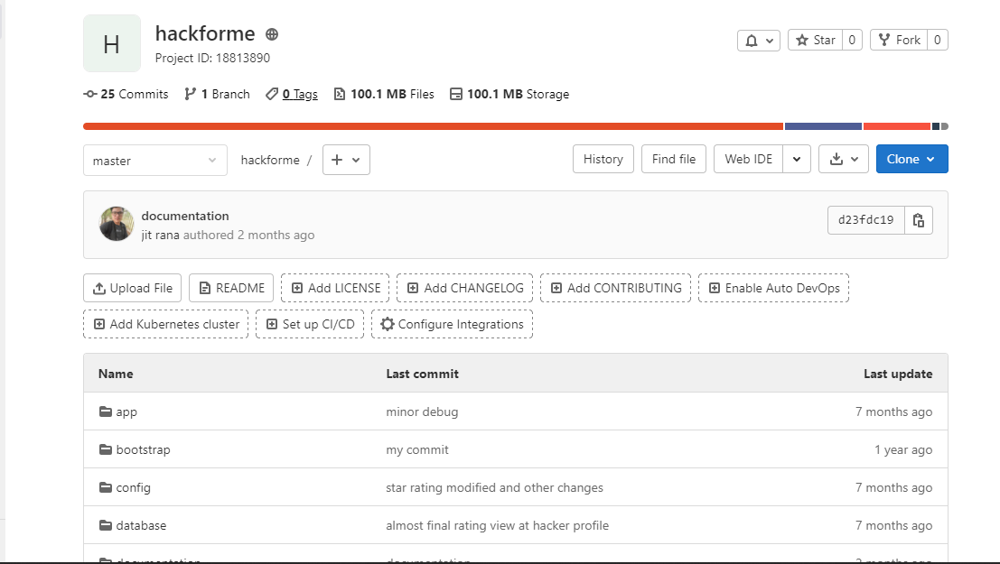

# Hacker4me
 Hy every one this is my 5'th semester project on  
   
 Hackforme which is just the platform for both hacker and business own compay to let chek their system to hacker for vulnerabilities
 I create this web app on gitlab...
 find this on my gitlab account  
 <h1>https://gitlab.com/jitu1234687/hackforme</h1>
 
 ## Gitlab Repo Shot

